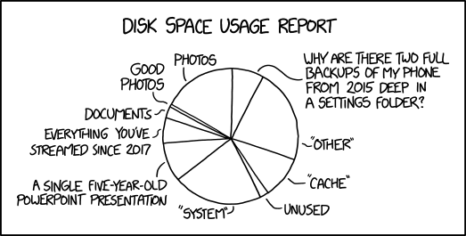
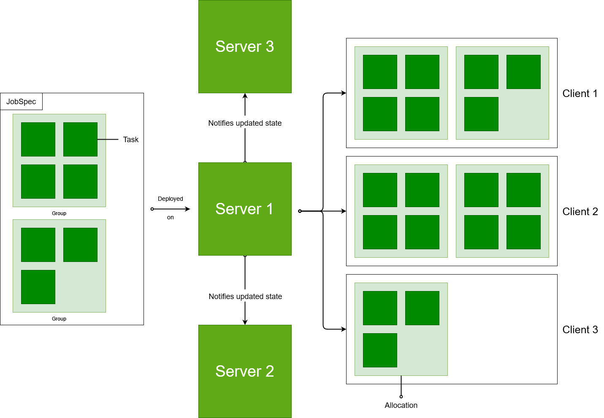

# Een introductie tot Nomad, een Gids voor Multi-Region Deployments

*Dennis Vlaanderen*, oktober 2023


---

Voor ontwikkelaars die zich bezighouden met schaalbare software-implementaties, is de wereld van DevOps vol met uitdagingen en mogelijkheden.
Het beheersen van de kunst van efficiënte multi-region deployments is een cruciaal aspect geworden in de snel evoluerende digitale landschappen van vandaag.

In deze complexe wereld van gedistribueerde systemen en geografisch verspreide gebruikers, komt Nomad naar voren als een krachtige en betrouwbare gids.
Deze blogpost werpt een licht op de cruciale rol die Nomad speelt in het vereenvoudigen van multi-region deployments.
Of je nu een ervaren ontwikkelaar bent die zoekt naar nieuwe manieren om wereldwijd schaalbare applicaties te implementeren, of een nieuwkomer die geïnteresseerd is in de mogelijkheden van DevOps, deze post biedt concrete inzichten en praktische toepassingen.

We duiken dieper in de wereld van multi-region deployments en laten zien hoe Nomad het mogelijk maakt om naadloos tussen verschillende regio's te schakelen.
Met Nomad kunnen ontwikkelaars hun applicaties effectief verdelen over diverse geografische locaties, met behoud van consistentie en betrouwbaarheid.

## Wijdverspreide beschikbaarheid

Multi-region deployments zijn een geavanceerde DevOps-praktijk waarbij softwareapplicaties en services worden uitgerold over meerdere geografische locaties.
Dit stelt bedrijven in staat om hun toepassingen wereldwijd beschikbaar te maken, waardoor ze kunnen profiteren van lagere latentie, verbeterde betrouwbaarheid en gegevensbescherming.
Met deze aanpak kunnen organisaties hun gebruikers bedienen vanuit de dichtstbijzijnde serverlocatie, wat resulteert in een naadloze gebruikerservaring, zelfs in verschillende delen van de wereld. (Goldman, 2022)

## Deployen van microservices

Container orchestration is het kloppende hart van moderne softwarearchitectuur. Het biedt een georganiseerd, efficiënt en schaalbaar systeem voor het beheren van containers, de draagbare eenheden waarin applicaties en hun afhankelijkheden zijn verpakt.
In de complexe wereld van hedendaagse IT, waar flexibiliteit en snelheid essentieel zijn, biedt container orchestration een gestroomlijnde methode om applicaties te implementeren, te schalen en te beheren.
Door automatisering van cruciale taken zoals load balancing, failover en resourcebeheer, stelt container orchestration teams in staat zich te concentreren op innovatie in plaats van zich zorgen te maken over de operationele complexiteit.
Het verhoogt niet alleen de operationele efficiëntie maar versnelt ook de ontwikkeltijd, waardoor bedrijven wendbaarder en concurrerender worden in de dynamische digitale markt (Mitra & Nadareishvili*, 2020).
Daarnaast verbeterd het ook de mogelijkheid tot ophalen van specifieke metrics door opsplitsing van kleine individuele services in plaats van één grote applicatie.

  
*Figuur 1*: Resource Management in handen van gebruikers

## Bouwstenen van Nomad

Nomad, HashiCorp's veelzijdige orchestratiesysteem, steunt op essentiële elementen voor naadloze multi-region deployments. Met de 'Job Specification' definieer je taken, terwijl 'Nodes' fysieke/virtuele machines vertegenwoordigen waarop taken draaien. 'Regions' beheren geografische afstanden, terwijl 'Schedulers' intelligent taken verdelen onder deze Regions. 'Federation' laat clusters wereldwijd samenwerken, terwijl netwerkintegratie en monitoring cruciaal zijn voor naadloze communicatie en prestatiemonitoring. Nomad biedt ook een robuuste API en CLI voor beheer, wat ontwikkelaars en operators in staat stelt om Nomad-gebaseerde implementaties moeiteloos te beheren, ongeacht hun locatie. Deze bouwstenen vormen de ruggengraat van Nomad's mogelijkheid om complexe wereldwijde implementaties te realiseren.

  
*Figuur 2*: Basis-architectuur Nomad

Zoals in figuur 2 is te zien is Nomad bedacht om meerdere servers binnen het cluster gelijk te kunnen houden.
Federation in Nomad maakt naadloze samenwerking mogelijk tussen meerdere clusters.
Dit verbetert de schaalbaarheid en maakt wereldwijde implementaties efficiënter door een gecentraliseerd beheer over verschillende clusters heen mogelijk te maken.
Het verschil tussen een client en een node is enkel dat een node op een gegeven moment actief is.
Als een node inactief is wordt deze als een client beschouwd. (*Introduction to Nomad | Nomad | HashiCorp Developer*, z.d.)

## Deploy naar Nomad

In  Nomad zijn er verschillende routes om je applicaties te lanceren.
Een van de meest directe paden is via de Command Line Interface (CLI), wat een snelle en eenvoudige manier is om je jobs naar Nomad te sturen.
Deze methode is geweldig voor ad-hoc taken, maar kan tekortschieten in meer geavanceerde scenario's zoals Continuous Integration/Continuous Deployment (CI/CD) pipelines.
Daarbij moet je directe SSH toegang hebben tot de Nomad server, wat niet altijd mogelijk is in een geautomatiseerde omgeving.

Daar komt de krachtige Nomad API om de hoek kijken.
Hoewel het wat complexer kan lijken, biedt het een gestroomlijnde manier om je jobs te deployen, vooral in geautomatiseerde CI/CD-pipelines.
Deze robuuste aanpak geeft je de controle en flexibiliteit die je nodig hebt om naadloos en betrouwbaar te implementeren, terwijl je profiteert van de voordelen van geautomatiseerde processen.

### Deploy via CLI

Deployment van jobs op Nomad via de CLI kan gedaan worden door het volgende commando uit te voeren:

```bash
nomad job run <job.hcl>
```

Hierbij is `<job.hcl>` het pad naar het bestand dat de job beschrijft. Als er geen fouten zijn in het bestand zal de job worden toegevoegd aan de job queue van Nomad. Deze job queue wordt dan verwerkt door de Nomad servers en zal de job starten op de nodes die aan de criteria voldoen. (*Commands: Job Run | Nomad | HashiCorp Developer*, z.d.)

### Deploy via API

Naast de CLI biedt een Nomad cluster ook een API aan. Deze API kan gebruikt worden om jobs te deployen naar de cluster. Dit kan gedaan worden door een POST request te sturen naar de `/v1/jobs` endpoint van de Nomad server. In dit request moet de job gespecifieerd worden in HCL formaat.


```bash
curl \
    --request POST \
    --data @<job.hcl> \
    --header "X-Nomad-Token: <token>" \
    http://<nomad-server>:4646/v1/jobs
```

Ook via de API wordt het opgegeven hcl bestand gevalideerd en wordt de job toegevoegd aan de job queue. (*Jobs - HTTP API | Nomad | HashiCorp Developer*, z.d.)

### Deployen van een job

Het definieren van een job kan op verschillende manieren. De meest gebruikte manier is via een HCL (HashiCorp Configuration Language) bestand.
Dit is een declaratieve taal die HashiCorp heeft ontwikkeld om configuratiebestanden te schrijven.
Oorspronkelijk is deze taal ontwikkeld voor Terraform, maar wordt nu ook gebruikt voor andere HashiCorp producten zoals Nomad.
Een voorbeeld van een HCL bestand is te zien in het codevoorbeeld hieronder. (Hashicorp, z.d.)

```hcl
job "example" {
  datacenters = ["dc1"] # default datacenter for development
  type = "service"

  group "example" {
    count = 1

    task "server" {
      driver = "docker"

      config {
        image = "hashicorp/http-echo"
        args = ["-text", "Hello World"]
      }

      resources {
        cpu    = 500 # 500 MHz
        memory = 256 # 256MB
        network {
          mbits = 10
          port "http" {
            static = 8080
          }
        }
      }
    }
  }
}
```

In dit voorbeeld wordt een job gedefinieerd met de naam `example`.
Deze wordt uitgevoerd in het datacenter `dc1` en is van het type `service`.
Voor een multi-regionale deployment kan dit aangepast worden naar `batch` of `system`.
Met de `batch` optie wordt de job uitgevoerd op een node die aan de criteria voldoet.
Met de `system` optie wordt de job uitgevoerd op alle nodes die aan de criteria voldoen.
Verder kunnen er ook specifieke datacenters worden opgegeven waar de job op uitgevoerd moet worden door deze toe te voegen aan de `datacenters` lijst.

De `example` job heeft een groep met de naam `example` die 1 keer moet worden uitgevoerd.
Deze groep heeft een taak met de naam `server` die gebruik maakt van de `docker` driver.
Deze taak heeft een configuratie met een image en een argument.
Ook heeft deze taak een resource configuratie met een cpu, geheugen en netwerk configuratie.
Deze configuratie wordt gebruikt om de taak te starten op een node die aan de criteria voldoet.

## Nomad vs Kubernetes: Wie wordt de dirigent van jouw orkest?

In het dynamische landschap van containerorchestratie staan Nomad en Kubernetes beide in de schijnwerpers, maar welke is de beste keuze voor jouw project, vooral als het aankomt op multi-regionale deployments?
Laten we een diepere duik nemen in de kenmerken van beide systemen, inclusief hun aanpak ten opzichte van wereldwijde implementaties.

  
*Figuur 3*: De valkuil van Data-gedreven besluitvorming

| **Meetpunt**                  | **Nomad**                             | **Kubernetes**                       |
|------------------------------|----------------------------------------|---------------------------------------|
| **Complexiteit**             | Eenvoudig en snel in te stellen, met minimale configuratie voor multi-regionale setups. | Complex, met een steile leercurve, maar biedt uitgebreide mogelijkheden voor wereldwijde schaalbaarheid. |
| **Multi-Regionale Implementatie** | Krachtige mogelijkheden voor wereldwijde deployments, eenvoudige configuratie voor het verdelen van taken over meerdere regio's. | Uitgebreide ondersteuning voor multi-regionale clusters, maar vereist grondige kennis voor optimale configuratie. |
| **Schaalbaarheid**           | Schaalbaar voor kleinere tot middelgrote implementaties, maar kan naadloos opschalen over meerdere regio's. | Uiterst schaalbaar, speciaal ontworpen voor complexe, grootschalige wereldwijde uitrol. |
| **Gemeenschap en Ondersteuning** | Kleiner, maar groeiende gemeenschap. | Uitgebreide gemeenschap met talloze bronnen en actieve ondersteuning. |
| **Onderhoud en Updates**     | Eenvoudiger, met minder complexiteit bij wereldwijde updates en onderhoud. | Updates kunnen complex zijn, vereisen zorgvuldige coördinatie, vooral in multi-regionale scenario's. |
| **Ondersteunde deployments** | Containers, VM's.          | Containers, VM's (met plugin).           |
| **Beheer van secrets**       | Ja, met Vault-integratie.               | Ja, met ingebouwde secrets manager.     |

**Wanneer voor Nomad te kiezen:**

- Als je wereldwijde deployments hebt en zoekt naar eenvoud en snelheid bij het configureren van multi-regionale taken.
- Voor kleinere tot middelgrote implementaties met de behoefte aan een intuïtieve, makkelijk in te stellen orchestratie-oplossing.

**Wanneer voor Kubernetes te kiezen:**

- Voor zeer grote, wereldwijde implementaties waar complexiteit geen belemmering is en waar behoefte is aan uiterste schaalbaarheid.
- Als je uitgebreide controle en configuratiemogelijkheden nodig hebt voor multi-regionale clusters.

Het kiezen tussen Nomad en Kubernetes hangt af van de schaal en complexiteit van je wereldwijde implementatie.
Nomad biedt een gebruiksvriendelijke benadering voor multi-regionale deployments, terwijl Kubernetes uitblinkt in complexe, grootschalige scenario's.
Het is essentieel om de specifieke vereisten en doelen van je project zorgvuldig te evalueren voordat je een definitieve keuze maakt.
Ook is het belangrijk om te weten dat Nomad strak geïntegreerd is met Vault, een krachtige secrets manager die je helpt om je gevoelige gegevens veilig te houden.
Kubernetes heeft een ingebouwde secrets manager, maar deze vergt meer configuratie en onderhoud.

De inzet van Nomad of Kubernetes is niet exclusief, en beide kunnen naast elkaar worden gebruikt om aan de behoeften van je project te voldoen.
Een voorbeeld hiervan is het gebruik van Nomad voor het beheren van virtuele machines en Kubernetes voor het beheren van containers.

Hopelijk heeft dit artikel je geholpen om een beter begrip te krijgen van de verschillen tussen Nomad en Kubernetes, en welke het beste past bij jouw behoeften.

## Bronnen

Goldman, M. (2022, 1 september). 5 reasons to build multi-region application architecture. *Cockroach Labs*.  
Geraadpleegd op 3 oktober 2023, van https://www.cockroachlabs.com/blog/5-reasons-to-build-multi-region-application-architecture/

Mitra, R., & Nadareishvili, I. (2020). Microservices: up and running: A Step-By-Step Guide to Building a Microservice Architecture. O’Reilly Media.

*Introduction to Nomad | Nomad | HashiCorp Developer.* (z.d.). Introduction to Nomad | Nomad | HashiCorp Developer. Geraadpleegd op 4 oktober 2023, van https://developer.hashicorp.com/nomad/tutorials/get-started/gs-overview

*Commands: Job Run | Nomad | HashiCorp Developer*. (z.d.). Commands: job run | Nomad | HashiCorp Developer. Geraadpleegd op 6 oktober 2023, van https://developer.hashicorp.com/nomad/docs/commands/job/run

Jobs - HTTP API | Nomad | HashiCorp Developer. (z.d.). Jobs - HTTP API | Nomad | HashiCorp Developer. Geraadpleegd op 6 oktober 2023, van https://developer.hashicorp.com/nomad/api-docs/jobs

Hashicorp. (z.d.). GitHub - Hashicorp/HCL: HCL is the HashiCorp configuration language. GitHub. Geraadpleegd op 6 oktober 2023, van https://github.com/hashicorp/hcl
